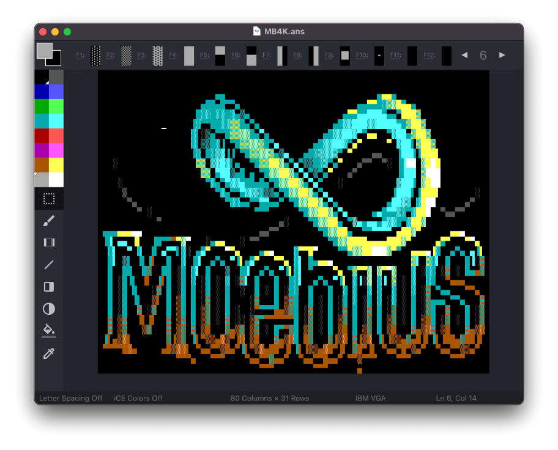

# Moebius

Moebius is an ANSI Editor for MacOS, Linux and Windows. The major feature that differentiates it from [PabloDraw](https://github.com/blocktronics/pablodraw) is the 'half-block' brush which allows editing in a style closer to Photoshop than a text editor, although you can still use the function and cursor keys to draw with, and you should find that most of the text editing features from PabloDraw are carried over to this editor. The editor is still a work in progress, but anyone who wants to try using it is also encouraged to [log feature requests and bugs](https://github.com/blocktronics/moebius/issues) on the project's GitHub page.

## Download packages
Packaged binaries are available through Github [Releases](https://github.com/blocktronics/moebius/releases) or from the direct links below:

* [MacOS](https://github.com/blocktronics/moebius/releases/latest/download/Moebius.dmg)
* [Windows Installer](https://github.com/blocktronics/moebius/releases/latest/download/Moebius.Setup.exe)
* [Windows Portable](https://github.com/blocktronics/moebius/releases/latest/download/Moebius.exe)
* [Debian Linux](https://github.com/blocktronics/moebius/releases/latest/download/Moebius.deb)

## Installation & building
```
git clone git@github.com:blocktronics/moebius.git
npm install
npm start
```

Moebius packages can be built easily with [electron-builder](https://github.com/electron-userland/electron-builder). Note that a build for MacOS must be made on MacOS.

```
npm run-script build-mac
npm run-script build-win
npm run-script build-linux
```

## Moebius Server
Moebius features collaboration by multiple users on the same canvas through a server instance. Users connect to a server which allows them to draw and chat. The server will also create hourly backups.

To start a server:
```
git clone git@github.com:blocktronics/moebius.git
npm install
node ./server.js
```

This will start a server with default settings. In this case a password will not be set and any value entered in the Moebius client will be accepted by the server. The server runs by default on port 8000, Moebius clients can modify the port by entering the server as hostname:port

The following parameters can be set:

* `--file=filename.ans` load an initial ANSI file after the server starts
* `--pass=password` set a server password which clients need to provide to logon to the server
* `--server_port=8000` set the server port, defaults to 8000.
* `--web` and `--web_port=80` run the webserver for external viewing (default port: 80). This enables live preview of the canvas, the preview and SAUCE information in a browser, the URL would be http://hostname.tld:web_port
* `--path=pathname` set a path for this server: users and webviewers would connect to hostname.tld/path
* `--quiet=true/false` suppress console output after the server has been started
* `--discord=url` Mirrors server joins and chat activity via a [Discord Webhook](https://support.discord.com/hc/en-us/articles/228383668-Intro-to-Webhooks)

## Acknowledgements
* Uses modified Google's Material Icons. https://material.io/icons/
* Contains ANSI art by Alpha King (Blocktronics), Filth (Blocktronics) and burps (FUEL)
* Included fonts:
  * Topaz originally appeared in Amiga Workbench, courtesy of Commodore Int.
  * P0t-NOoDLE appears courtesy of Leo 'Nudel' Davidson
  * mO'sOul appears courtesy of Desoto/Mo'Soul

## License
Copyright 2022 Andy Herbert

Licensed under the [Apache License, version 2.0](https://github.com/blocktronics/moebius/blob/master/LICENSE.txt)

## Links
* Moebius homepage: [https://blocktronics.github.io/moebius/](https://blocktronics.github.io/moebius/)
* SAUCE: [http://www.acid.org/info/sauce/sauce.htm](http://www.acid.org/info/sauce/sauce.htm)
